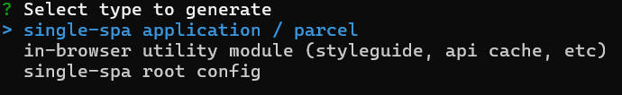
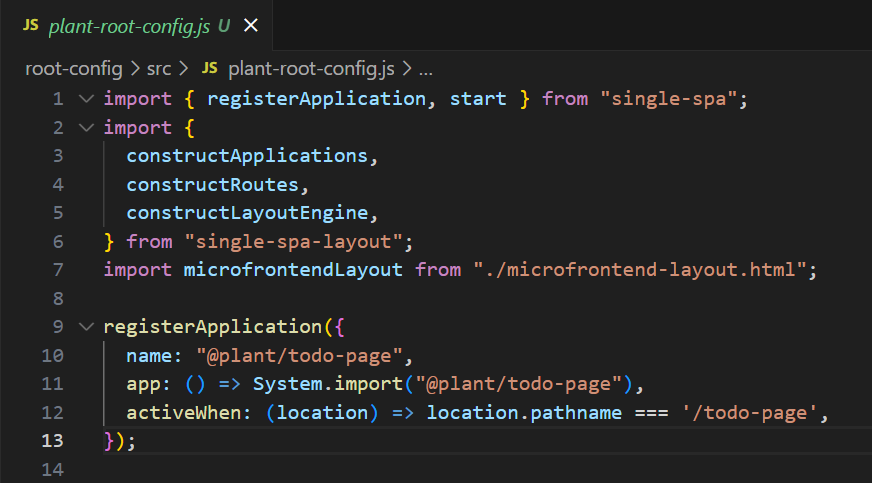
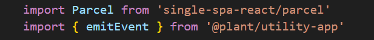
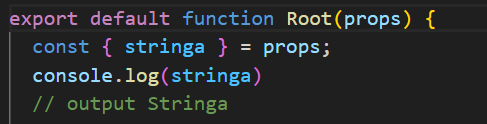

# Creazione del Progetto

creazione progetto todo introduzione ai Microfrontend (MFE) con single-spa.

## Tipologie di MFE

Durante l'inizializzazione del progetto, il framework ci propone 3 diverse tipologie di MFE:

### Single-spa Application/Parcel

Quando si parla di 'Application', ci si riferisce a un MFE inteso come una pagina (ad esempio Home, Profilo). Il 'Parcel', d'altra parte, è un tipo specifico di 'Application' che rappresenta un componente (come una navbar o una tabella).

### In-browser utility module

Questo MFE è condiviso tra i vari MFE e viene utilizzato per condividere codice (come ad esempio css globale o una funzione che formatta le date). È raccomandato dal framework per essere utilizzato come service per le chiamate AJAX.

### Single-spa Root-config

MFE orchestratore, all'interno del Root-config registriamo tutti i nostri MFE, gestiamo il routing, durante l'inizializzazione ci chiederà se generare un single spa layout, ovvero un file dove gestire il layout, in questo file possiamo inserire dei MFE parcel, ad esempio una navbar che è condivisa tra tutti i MFE in modo da inserirla una singola volta. Il Root-config può gestire anche lo stato globale dell'applicazione.

## Composizione del Progetto

Il progetto è composto da 4 MFE:
1. root-config (MFE orchestratore).
2. todo-page (MFE pagina).
3. todo-table (MFE Parcel).
4. utility-app (MFE di utilità).

## Avvio dei MFE

Il MFE todo-table (Parcel) così come gli altri due MFE (todo-page, utility-app) non sono ancora registrati nel MFE orchestratore e per questo non è possibile testarli nel flusso dell'applicazione. Per avviarli in modo indipendente, è possibile eseguire il comando `npm run start:standalone`.

## Verifica dell'Avvio

Se tutto funziona correttamente, dovremmo vedere a schermo "@org/nomeprogetto is mounted!". Questo codice si trova nel file root-component.js del nostro MFE ed è il file root (App.js in React) del nostro MFE.

    
    

## Note

In caso di errori di sintassi eliminare il file `.eslintrc`.  
plant è il nome della org inserita in fase di inizializzazione del MFE, single-spa genera i file con organizzazione seguito dal nome del progetto.

## Analisi progetto Root-config

passiamo al MFE root-config (orchestratore), questo mfe all'interno della cartella src presenta 3 file, index.ejs, plant-root-config.js, microfrontend-layout.html.  
come prima cosa inserisco nello script start del package.json di utility.app, todo-page e todo-table una porta a mia scelta.  

### index.ejs

Nel file in questione, gestiamo la registrazione MFE all'interno dell'applicazione. Per registrare un MFE all'interno del root-config, è necessario aggiungere l'URL generato dal MFE allo script type="systemjs-importmap" all'interno della condizione if (isLocal). L'oggetto import è composto da una proprietà, scelta da noi, che funge da identificativo per importare o far comunicare i MFE tra loro, associata al relativo valore

## Note

single-spa/welcome è il microfrontend di benvenuto generato da single-spa.  
in caso di errore in console "Unable to resolve bare specifier 'react'", bisogna importare react nel file index.ejs, prendere i cdn da [react.org](https://it.legacy.reactjs.org/docs/cdn-links.html) ed inserirli nell'oggetto import del tag script type="systemjs-importmap" in questo modo (ho utilizzato la versione 17).

### plant-root-config.js

questo file registra le rotte all'interno dell'applicazione, ho registrato una rotta attraverso la funzione registerApplication.   
Questa funzione accetta un oggetto con tre chiavi principali:  

<b>name</b>: Il nome dell'applicazione.  
<b>app</b>: Una funzione che restituisce una promise per importare l'applicazione. (@plant/todo-page nell'import è la proprietà presente nel file index.ejs che utilizziamo per importare il MFE).  
<b>activeWhen</b>: Una funzione che specifica quando il MFE deve essere attivato, ritorna un booleano, nel nostro caso associamo il MFE alla rotta "/todo-page".  

### microfrontend-layout.html

se andiamo su http://localhost:9000 vedremo il microfrontend di benvenuto generato da single-spa, se cambiamo rotta ed inseriamo quella appena creata, ovvero http://localhost:9000/todo-page, avremo @org/nomeprogetto is mounted a schermo più il microfrontend di benvenuto, questo accade perchè nel file microfrontend-layout.html c'è un blocco di codice con tag application con name "@single-spa/welcome", il nome anche in questo caso è la proprietà inserita nel file index.ejs dell'oggetto import. ciò che accade in questo file è che rende i microfrontend che importiamo presenti in tutta l'applicazione, questo è utile per i microfrontend condivisi come per esempio la navbar, in questo progetto si può rimuovere

## Analisi progetto utility-app

all'interno del file plant-utility-app.js del progetto inserirò queste due funzioni di utilità che importerò nei MFE application/parcel.

## Analisi progetto todo-page

### plant-todo-page.js

questo file carica il nostro file root (root.component.js), al suo interno sono presenti 3 cicli di vita, bootstrap, mount, onmount.

### root.component.js

in questo file costruiamo la logica del todo, inseriamo input e button.

dopo aver inserito input e button importiamo sia il MFE utility-app che il MFE todo-table, per importare il MFE di utility utilizziamo (@plant/utility-app) ovvero la proprietà del MFE a cui ho associato l'URL nel file index.ejs del MFE orchestratore, per importare il MFE todo-table importiamo il componente Parcel di single-spa;

adesso possiamo utilizzare la funzione di utilty-app per emettere l'evento ed il Componente Parcel di single-spa e tramite l'attributo config importeremo il MFE todo-table.

output del codice

## Analisi progetto todo-table

i file presenti in src del MFE todo-table sono gli stessi del MFE todo-page essendo che il 'Parcel', è un tipo specifico di 'Application', quello che ci interessa è creare l'interfaccia grafica, ovvero la tabella dove stampare il todo, nel file root.component.js importeremo la funzione da utilty-app per ascoltare l'evento e lo stamperemo a schermo nella tabella.

### root.component.js

output del codice: 

## passare props tramite Parcel

root.component.js di todo-page

root.component.js di todo-table

